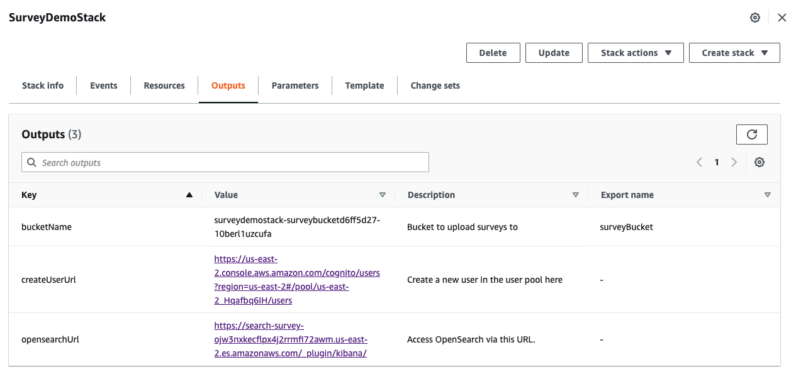
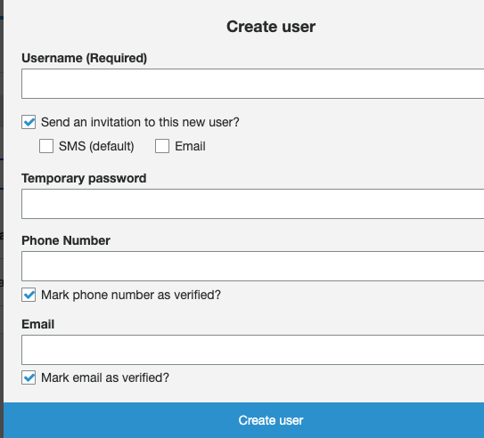
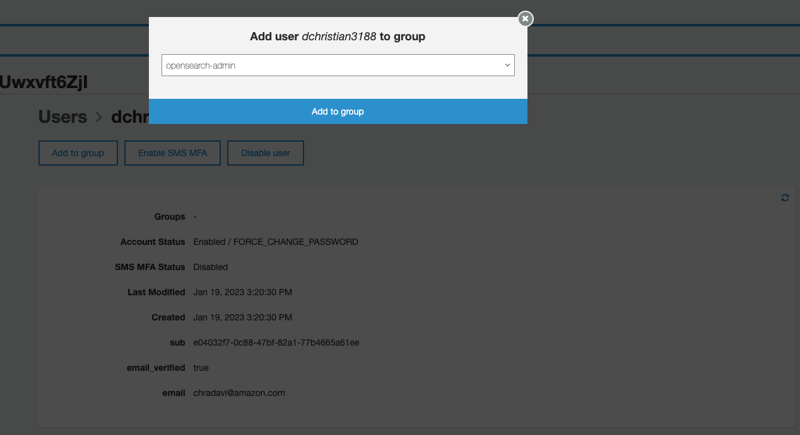

# aws-survey-demo

This project uses different AWS services to parse and visualize surveys. 


# Installation

## Requirements
This project requires 
1) CDK
1) Docker: Docker is used to build the Python Lambda. You will need docker installed and running to build and deploy this project

## Deploy
Start by cloning this repository.

```
git clone https://github.com/dchristian3188/aws-survey-demo.git
```

Change into the CDK folder.

```
cd aws-survey-demo/src/
```

Install the CDK packages.

```
npm install
```

Deploy the stack using the CDK.
Note: After you run this command you will see a prompt asking to confirm role creation.
Select yes, to continue.

```
cdk deploy
```
## Adding Surveys

As part of the deployment an S3 bucket was created. 
Navigate to this bucket and place pictures of your survey in the input folder. 

Upload your png, jpeg, or pdfs to this folder.
Note that the file size must be under 5MB.

The sample survey format is provided in this repository under survey data.
Textract has been configured to parse the questions from this survey.
You can customize these questions by updating ```src/survey-Data/questions.json```


## Access the Dashboard

As soon as the application is deployed completely the outputs of the AWS CloudFormation stack provides the links for the next steps. You will find two URLs in the AWS CloudFormation console called `createUserUrl` and `opensearchUrl`.



* Use the `createUserUrl` link from the outputs, or navigate to the Amazon Cognito user pool in the console to create a new user in the pool. **Enter an email address as username and email**. **Enter a temporary password** of your choice with at least 8 characters. Leave the phone number empty and **uncheck the checkbox to mark the phone number as verified**. If you like you can check the checkboxes to send an invitation to the new user or to make the user verify the email address. Then choose **Create user**.

 

Next add the user to the `es-admins` group:



* Access the OpenSearch dashboard with the `opensearchUrl` link from the outputs, or navigate to the dashboard link displayed in the Amazon OpenSearch Service console.

# Resources

https://github.com/aws-samples/amazon-elasticsearch-service-with-cognito


https://github.com/aws-samples/aws-ai-intelligent-document-processing

